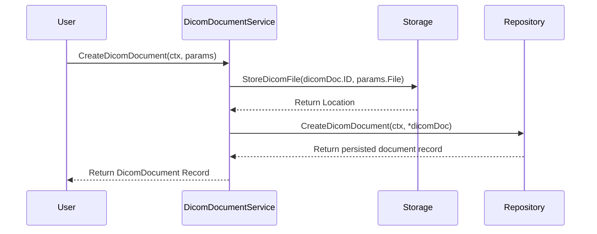
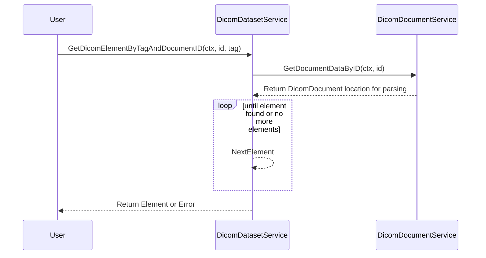

# dicom-parser-app

## SUMMARY
This is a simple docker application that allows you to 
- Create DICOM document records
- Read DICOM document records
  - Read all the Data Elements in a document
  - Read a specific element in a document by its tag
- Convert DICOM document records to a PNG image

## Service Stack
- Golang 1.22.4 for backend server logic
- AWS DynamoDB for data storage
- Docker for local development

## How to Run

### Prerequisites
- Docker
- Docker Compose
- Make
- Go 1.22.4

1. Clone the repository
2. Run the following commands
```
make init
make run-docker
```

## HOW TO USE
Here's a link to the Postman collection that you can use to interact with the API:

[](https://app.getpostman.com/run-collection/1162575-a532fdc9-d543-4056-a784-da3cba005d74?action=collection%2Ffork&source=rip_markdown&collection-url=entityId%3D1162575-a532fdc9-d543-4056-a784-da3cba005d74%26entityType%3Dcollection%26workspaceId%3D65d14c3a-851f-4f1b-a02a-a7543937f242)

## Run the following command to run the tests
```
make unit-test
```

## API Documentation
The API documentation can be found in the `docs` folder

## Architecture

### Overview
The application is a simple REST API that allows you to create, read, and convert DICOM documents. The application is built using Golang and AWS DynamoDB. The application is containerized using Docker and Docker Compose for local development.

### Design
The service consists of 2 domain models:
- `DicomDocument` - Represents a DICOM document record
  - `ID` - The unique identifier of the document. This is a auto-generated UUID
  - `Name` - The name of the document
  - `Location` - The location of the document in the local store
- `DicomDataset` -  Represents a DICOM dataset record
  - `ID` - The unique identifier of the dataset. This is a auto-generated UUID
  - `DocumentID` - The unique identifier of the document that the dataset belongs to
  - `Tag` - The tags available in the dataset

### Explanation
#### Create DICOM Document Flow


#### Get DICOM Tags by document ID Flow



## Improvements
- Be able to create DICOM idempotent records by sequence number
- Add more test coverage
- Add standardized error definitions
- Add standardized response definitions
- Add stricter request validation/authorization middlewares
- Async parsing of the DICOM files
- Replace the local store with Azure Blob Storage Emulator for local dev
- Refactor dicom parsing package implementation leakage
- Cross service interaction should be handlers or message bus


